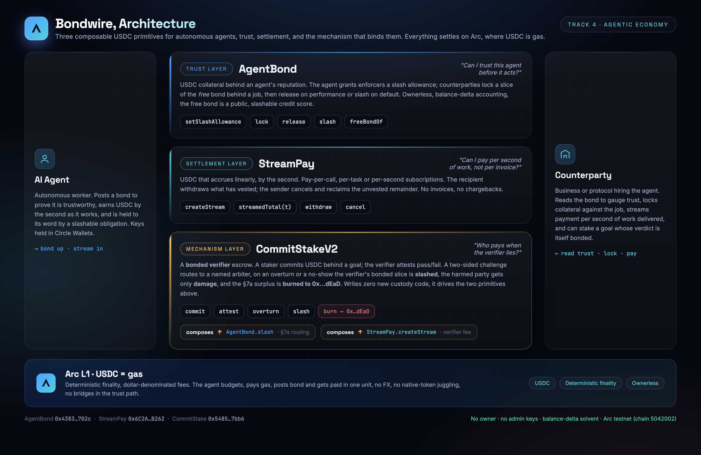

# Bondwire

[](https://github.com/Mnorbert87/bondwire/actions/workflows/test.yml)

**Trust and settlement primitives for autonomous agents, settled in USDC on Arc.**

Submitted to the Circle *Stablecoin Commerce Stack Challenge*, **Track 4: Best Agentic Economy Experience on Arc.**

Every "agentic" demo quietly assumes two things that don't actually exist on-chain yet: that you can **trust an agent before it touches your money**, and that you can **pay it continuously as it works** instead of after the fact. Bondwire ships both as small, composable, ownerless contracts.

| | Layer | Contract | What it answers |
|---|---|---|---|
| 🛡️ | **Trust** | [`AgentBond`](#agentbond-trust-layer) | *"Can I trust this agent before it acts?"* |
| 💧 | **Settlement** | [`StreamPay`](#streampay-settlement-layer) | *"Can I pay it per second of work, not per invoice?"* |
| 🔥 | **Mechanism** | [`CommitStakeV2`](#commitstakev2-who-pays-when-the-verifier-lies) | *"Who pays when the verifier lies?"* |

The two primitives each work standalone. `CommitStakeV2` composes both into a complete, ownerless
trust-and-pay rail for autonomous agents.

---

## Live demo

- **Hub:** https://bondwire.dev/
- **Use case, hire an AI service agent:** https://bondwire.dev/use-case/
- **Bonded verifier (live CommitStakeV2 flow):** https://bondwire.dev/bonded-verifier/ , create a staked commitment, verifier resolves, challenge window, arbiter rules, finalize. Every step is a real MetaMask tx confirmed on arcscan.
- **AgentBond:** https://bondwire.dev/agent-bond/
- **StreamPay:** https://bondwire.dev/stream-pay/
- **x402 pay-per-call demo (runnable):** [`x402-demo/`](./x402-demo/), agent pays an API over HTTP `402`, settled per second on StreamPay. [Verified tx transcript](./x402-demo/SAMPLE_RUN.md).
- **CCTP capital onboarding (runnable):** [`cctp-demo/`](./cctp-demo/), an agent's bond capital is bridged **Base Sepolia → Arc** with Circle **Bridge Kit** (App Kit, CCTP V2) and deposited into AgentBond. [Verified tx transcript](./cctp-demo/SAMPLE_RUN.md).

No backend. The frontends read live state straight from the public Arc RPC and write through MetaMask. Wallet not required to browse.

> ⚠️ **Testnet demo only.** Deployed on Arc Testnet (chain `5042002`). Not audited for production; do not send mainnet funds.

---

## Deployments (Arc Testnet · chain 5042002)

| Contract | Address |
|---|---|
| AgentBond | [`0x4383Ea48837eF7e60fC22BD67945BCBf0551702c`](https://testnet.arcscan.app/address/0x4383Ea48837eF7e60fC22BD67945BCBf0551702c) |
| StreamPay | [`0x6C2Ae6f8Ba7c0259EABa8ef4048C8BFc68BAB262`](https://testnet.arcscan.app/address/0x6C2Ae6f8Ba7c0259EABa8ef4048C8BFc68BAB262) |
| CommitStakeV2 | [`0xf3457ABfd042Ef41bC22Ab20714D4D49cAaf1474`](https://testnet.arcscan.app/address/0xf3457ABfd042Ef41bC22Ab20714D4D49cAaf1474) · exact-match verified |

> Verification status, precisely: All three contracts are **fully verified on the explorer and exact-match**: recompile this repo and the deployed runtime matches byte for byte, including the metadata trailer, with only the constructor-set immutable addresses differing. This is the redeploy of 2026-07-31; the earlier deployment had AgentBond and StreamPay served as partial matches out of Blockscout's bytecode database, which is exactly what the redeploy fixed.

- **RPC:** `https://rpc.testnet.arc.network`
- **Explorer:** `https://testnet.arcscan.app`
- **Gas / settlement token:** USDC (native gas on Arc; 6-decimal ERC-20 for value)

---

## Architecture



An autonomous agent lifecycle, settled end-to-end in USDC:

1. **Bond up**, the agent deposits USDC into `AgentBond`. Its *free* bond becomes a public, slashable credit score. *(AgentBond)*
2. **Get hired**, a counterparty reads the bond and decides the agent is trustworthy enough for the job. *(off-chain)*
3. **Lock collateral**, an agent-authorized *enforcer* locks a slice of the agent's bond behind the job as an *obligation*, payable to the counterparty if defaulted. *(AgentBond)*
4. **Stream pay**, it opens a `StreamPay` stream; the agent earns USDC by the second as it works. *(StreamPay)*
5. **Settle**, performed → bond released & stream withdrawn; defaulted → bond slashed to the creditor, stream cancelled. *(both)*

Both contracts are **ownerless**, no admin, no upgrade key, and track balances by **real balance delta**, so they stay solvent against any token and can't be rugged by privileged roles.

### AgentBond, trust layer

A reputation deposit that behaves like an ERC-20 allowance system for *slashing*:

- `deposit(amount)` / `withdraw(amount)`, manage your bond. *Free* bond = total − locked.
- `setSlashAllowance(enforcer, amount)`, authorize a specific protocol to lock & slash up to `amount`. Set `0` to revoke.
- `lock(agent, creditor, amount, deadline) → id`, an enforcer locks a slice of an agent's bond behind an obligation (spends the allowance). `deadline` (unix seconds, `0` = none) lets the agent self-release if the enforcer goes silent.
- `release(id)`, obligation settled; capacity revolves back to free bond. Callable by the enforcer any time, or by the **agent** after a non-zero `deadline` passes (anti-griefing, no enforcer can lock a bond forever).
- `slash(id)`, agent defaulted; the bond pays the creditor, that capacity is burned.

### StreamPay, settlement layer

Linear, per-second USDC accrual, the right shape for continuous agent work:

- `createStream(recipient, deposit, start, stop, memo) → id`, escrow USDC that vests linearly between `start` and `stop`.
- `balanceOf(id)`, how much has vested to the recipient right now.
- `withdraw(id, amount)`, recipient pulls vested funds at any moment.
- `cancel(id)`, split the stream at "now": recipient keeps the vested part, sender reclaims the rest.

Concrete fits from the Track 4 brief: **pay-per-inference agents**, **per-API-call billing**, and **per-second / streaming subscriptions**.

---

## CommitStakeV2, who pays when the verifier lies?

The two primitives answer *"can I trust the agent?"* and *"can I pay it continuously?"*. They leave one
question open: when a **verifier** vouches for an agent's work and is wrong, by laziness or by
collusion, who eats the cost? `CommitStakeV2` is the mechanism that answers it, and it writes **zero
new custody code**: it drives `AgentBond`'s slash allowance and opens a `StreamPay` fee stream itself.
It is the composability thesis made executable, a mechanism built *on* the two primitives, not beside them.

Three claims, each backed by something you can re-run:

1. **Bonded verifier, recursive trust.** The verifier posts its own `AgentBond` bond and grants
   CommitStakeV2 a revocable slash allowance. Trusting the agent's result reduces to trusting a party
   with skin in the game, and that skin is enforced on-chain, not promised.
2. **The raid finding, closed by full accounting, not patched over.** A 4th-gate cold adversarial
   audit found that an uncapped `arbiterFee` could feed `damage` until it equalled the slice, zeroing
   the §7a **surplus-burn**, the anti-collusion device at the core of the mechanism. The fix folds
   `arbiterFee` into the slice-sizing rule so `surplus = slice − damage` stays **strictly positive**
   by construction: a colluding arbiter can never recapture the slice. Found by counting it through,
   closed by counting it through. ([TEST_AUDIT.md](./contracts/commit-stake-v2/TEST_AUDIT.md))
3. **Symbolically-verified surplus-burn, proven live.** Halmos proves solvency, surplus-positivity,
   split conservation and the fee-residue bound **for all inputs**; two on-chain artifacts show the burn
   actually happening: an overturn burn of **1.45 USDC**
   ([tx](https://testnet.arcscan.app/tx/0xf46f062d8ff0be20cccc35bee1faf321f8418be7b7f02045efeac2fb0f3e9d1d))
   and a liveness burn of the **whole 1.50 USDC slice**
   ([tx](https://testnet.arcscan.app/tx/0xae25f95183bd6af798cf1f6a82222aeca35eae73553575449a403c8b03b5a364))
   to `0x…dEaD`.

**Trust boundary, what the burn buys, stated up front.** Closing the recapture path means a
colluding arbiter can never *take* the slice (claim 2, symbolically proven). It does **not** make
the arbiter *honest*. A staker can name an arbiter that is only address-distinct from the parties
(`CommitStakeV2.sol:335-337`) and, on a *correct* verdict, have it overturn, burning an honest
verifier's slice.

**Correction (2026-07-24):** this paragraph used to say that case is *"griefing, not theft: the
attacker nets ≈ gas and never a profit"*. **That was wrong**, and a PoC measurement corrected it.
The arbiter fee is reimbursed to the harmed party out of the slashed slice (`damage = feeAccrued +
fee`, `CommitStakeV2.sol:533-537`) *and* paid to the arbiter out of the challenger's own bond
(`:545`), which the challenger gets refunded (`:546`). Between independent parties that nets exactly
0 (control run). Behind one entity, it is profit taken from the verifier: **+5.000000 USDC measured
from a 1 USDC dust stake against a 150 USDC slice**, scaling to **~99.99% of the slice** when
`arbiterFee` is set high, since nothing caps it relative to the slice. So it *is* theft from the
verifier, and the §7a burn bounds only how much is destroyed, not how much the attacker keeps. Full
measurement, table and defense in [THREAT_MODEL §8](THREAT_MODEL.md). The verifier's exposure is
bounded today by the **slash allowance** it grants AgentBond (spent per `lock`), so the operational
defense on the deployed release is a minimal per-job allowance, and a blanket allowance is unsafe.
Removing this is on the **roadmap**: per-commitment verifier
opt-in to the named arbiter (or an AgentBond arbiter allowlist), plus a stake-proportional slice cap
`verifierSlice ≤ k·(amount + feeDeposit + arbiterFee)`. We state this because a careful reviewer
reaches it: the symbolic spec proves the *accounting* of a slash, not the *justness* of the verdict
,  arbiter honesty is an assumption, exactly as the verifier's is. The fix is implemented, tested
(88 tests green at the time, 125 today), and deployed in the hardened redeploy of 2026-07-31: see
[THREAT_MODEL §8](./THREAT_MODEL.md) and Draft [PR #1](https://github.com/Mnorbert87/bondwire/pull/1).

The spec ([VERIFIER_ECONOMICS.md](./VERIFIER_ECONOMICS.md)) was already public; with this the
**implementation, the source-verified deploy, and a four-layer audit trail now sit in one repo beside it**:

| Layer | Document | What it proves |
|---|---|---|
| Symbolic | [HALMOS_VERIFICATION.md](./contracts/commit-stake-v2/HALMOS_VERIFICATION.md) | solvency / surplus-positivity / split conservation, all inputs |
| Static | [STATIC_ANALYSIS.md](./contracts/commit-stake-v2/STATIC_ANALYSIS.md) | zero new vulns; every flag triaged, by-design items annotated in-source |
| Mutation | [MUTATION_TESTING.md](./contracts/commit-stake-v2/MUTATION_TESTING.md) | 100% revert-class kill; survivors triaged equivalent / invariant-caught |
| Gas | [GAS_PROFILE.md](./contracts/commit-stake-v2/GAS_PROFILE.md) | the full slash+burn path costs ~0.008 USDC over a plain finalize |

`CommitStakeV2` `0xf3457ABfd042Ef41bC22Ab20714D4D49cAaf1474`, Blockscout exact-match verified, 125-test
suite (unit + adversarial + cold-audit + edge + fuzz + 10k-run invariants + symbolic spec) green.

---

## Arc-native agent identity (ERC-8004)

Both demo agents hold a real on-chain identity in Arc's official **ERC-8004 `IdentityRegistry`**
([`0x8004A818…BD9e`](https://testnet.arcscan.app/address/0x8004A818BFB912233c491871b3d84c89A494BD9e)) , 
`register(metadataURI)` mints an ERC-721 identity NFT whose `tokenURI` resolves to the agent's
hosted metadata (name, type, capabilities, version):

| Agent | tokenId | metadata | register tx |
|---|---|---|---|
| **Aiden** (AI research service agent) | `471762` | [`aiden.json`](https://bondwire.dev/agents/aiden.json) | [`0x8afedd…8cfa2`](https://testnet.arcscan.app/tx/0x8afedd30f718a82752811f6daab1c41d81e215eb0020e4eca76db0379888cfa2) |
| **Arc Stack Verifier** (bonded verifier) | `471763` | [`verifier.json`](https://bondwire.dev/agents/verifier.json) | [`0xe2eb9b…cdae`](https://testnet.arcscan.app/tx/0xe2eb9b94cd1d4afe292f1bf9d4b859b122c96d6ca8f4a49a8d88c78bf86bcdae) |

> **Corrected on-chain 2026-08-05.** Until today that sentence was false in the only place it
> counts, the chain. Both `tokenURI`s still returned the pre-rebrand
> `…/arc-agentic-stack/agents/…` path, which 404s, while this table linked the working one, so
> reading the docs never surfaced it and only calling `tokenURI` did. Repointed with
> `setAgentURI`, [`0x314da644…7866e629`](https://testnet.arcscan.app/tx/0x314da64458e3da95e8c2dfc0958f0ffb7861f07fd4cf1a8ed5ec64417866e629)
> and [`0xb0331dbe…d23f709609`](https://testnet.arcscan.app/tx/0xb0331dbee7d759459bf3dbeefca12d2a1b15c3556cdaa09693c6fdd23f709609),
> then read back off the chain and fetched: both resolve `200`.

The full ERC-8004 surface is exercised on-chain, not just `register`:
- **Reputation**, a counterparty left a real **`ReputationRegistry.giveFeedback`** for Aiden
  (value `5`, tags `research-quality` / `on-time-delivery`), from a *distinct* address (self-feedback
  is not the point): [`0x775a67…5884`](https://testnet.arcscan.app/tx/0x775a67b9d30017d3c60c43c2b82b5a491ae9a45222c8a6de3fe23c6f195f5884). `readFeedback` returns it on-chain.
- **Operational wallet**, Aiden's identity binds a separate operational wallet via
  **`IdentityRegistry.setAgentWallet`** (EIP-712 signed by that wallet, owner submits):
  [`0x2910b8…4344`](https://testnet.arcscan.app/tx/0x2910b8d8eaee2cd5c6270a5348d1b7e7e79499d03c752d4f8554d0ba53084344), `getAgentWallet(471762)` now resolves to the bound key, so custody (the NFT owner) and execution (the agent wallet) are cleanly separated.

**Why this matters, we complement ERC-8004, we don't duplicate it.** ERC-8004 (and the related
job/validation work) is the **identity and job-coordination layer**: it answers *"which agent is
this, and what did it agree to do?"* It does **not** answer *"what happens, economically, when the
agent lies or vanishes?"* That economic-assurance layer is exactly what this stack adds: a
**bonded verifier** (slashable skin-in-the-game), deterministic **§7a slash routing** (damage to
the harmed party, surplus burned), and **streaming pay** so failure is non-binary. An ERC-8004
agent gains, on the same chain and the same USDC, the missing layer that makes its attestations
*cost something to fake*.

**vs. the `circlefin/arc-escrow` sample.** A classic escrow holds funds and releases them on a
trusted signal. Here the **verifier itself is bonded and slashable**, trusting its verdict reduces
to trusting an on-chain bond, not a privileged signer, the contracts are **ownerless with no admin
keys**, and the whole dispute path (slash, burn, refund) is **pure on-chain logic with balance-delta
accounting**, not an operator pressing "release." It is the difference between an escrow you trust to
release and a verifier you can *slash*.

This runs where it does because **Arc** gives it the settlement guarantees agentic value transfer
needs: **sub-second deterministic finality with zero reorgs**, fees of **~$0.01 a transaction**, and
USDC as the native gas token, so an agent budgets, bonds, streams and settles in one dollar-
denominated unit, and a slashed bond is final the moment the block lands.

---

## Design FAQ, anticipated questions

**Who can slash a bond? Can a counterparty just take the money and run?**
No. A creditor *cannot* slash, they are only the address a slash pays out to. Slashing is gated to a single `enforcer` contract that **the agent itself authorized** via `setSlashAllowance(enforcer, amount)`, capped at a chosen amount and revocable to `0` at any time (`slash` requires `msg.sender == enforcer`). And if that enforcer goes silent, a non-zero `deadline` lets the **agent** self-`release` and reclaim its bond, so no one can lock collateral forever. Dispute resolution is deliberately *not* hardcoded: the enforcer is pluggable (a co-signed attestation, a multisig, an optimistic oracle, a Kleros-style court). `AgentBond` ships the slashing *primitive*; the policy is yours to choose. This is the composability thesis, not a missing piece.

**Doesn't per-second streaming + pay-per-call flood the chain with transactions?**
For streaming, no, and it's a common misconception. `StreamPay` does **not** transact per second. A stream is ~2–3 on-chain transactions *total*: one to open, one (or a few) `withdraw`s whenever the recipient chooses, and an optional `cancel`. Accrual is a pure `view` computation (`deposit × elapsed ÷ duration`), zero transactions while it runs, whether the stream lasts a minute or a month. Pay-per-call (x402) *is* one transaction per paid call by design; that high-frequency path is exactly what Arc's USDC-denominated, fast-finality settlement is built for, and it composes with `StreamPay` so repeated calls to one provider can settle as a single stream instead of N discrete payments.

**Does the bond punish an agent for an honest LLM mistake, not just malice?**
Yes, by design, because on-chain you can only verify *outcomes*, not *intent*. A bond is an SLA, not a morality test: a contractor who underdelivers through incompetence still forfeits their deposit, same as one who defrauds. Two things soften this in the stack: (1) `StreamPay` makes failure **non-binary**, an agent that fails mid-job has already been paid for the seconds it actually worked; only the remainder is at risk, so a stumble isn't a total loss; and (2) what counts as "performed" is decided at the *enforcer / verification* layer you plug in, not in the bond primitive, so domain-appropriate fairness (retries, partial credit, human review) lives where it belongs. Reliability remains the agent's responsibility: better models, self-checks, or a shared insurance pool.

---

## Verification, tests, fuzz, invariants, threat model

Every contract in the stack ships with a unit + adversarial + fuzz + **invariant** suite, run on every push by [CI](.github/workflows/test.yml). The invariants are checked against *ghost ledgers built from real ERC-20 balance movements*, the tests never trust the contract's own bookkeeping. Actual numbers from the current suite on this branch (forge 1.7.1, same config enforced in CI). **Tests** is the `forge test` total per project; **Fuzz properties** counts `testFuzz_` functions and **Invariants** counts `invariant_` functions, wherever in the suite they live — some sit outside the dedicated `*Fuzz`/`*Invariant` files:

| Project | Tests | Fuzz properties | Invariants | Invariant campaign | Result |
|---|---|---|---|---|---|
| [`contracts/agent-bond`](contracts/agent-bond/README.md) | 51 | 5 × 10,000 runs | 4 | each 10,000 runs × depth 15 = 150,000 calls | ✅ 0 failed, 0 violations |
| [`contracts/stream-pay`](contracts/stream-pay/README.md) | 25 | 5 × 10,000 runs | 3 | each 10,000 runs × depth 15 = 150,000 calls | ✅ 0 failed, 0 violations |
| [`contracts/commit-stake`](contracts/commit-stake/README.md) | 28 | 6 × 10,000 runs | 4 | each 10,000 runs × depth 15 = 150,000 calls | ✅ 0 failed, 0 violations |
| [`contracts/commit-stake-v2`](contracts/commit-stake-v2/TEST_AUDIT.md) | 125 | 8 × 10,000 runs | 5 | each 10,000 runs × depth 15 = 150,000 calls | ✅ 0 failed, 0 violations |

`commit-stake-v2` carries three layers the others don't: **5 Halmos symbolic proofs** (all-inputs
solvency / surplus-positivity / split conservation), a **Slither + Aderyn** pass with by-design findings
annotated in-source and `--fail-pedantic` in CI, and a **mutation campaign** (100% revert-class kill).
The full trail is in [its audit docs](#commitstakev2-who-pays-when-the-verifier-lies).

Headline invariants (full statements in the per-project READMEs):

- **Solvency** (all three): the contract's real USDC balance always equals observed inflows minus observed outflows, it can never pay out more than was paid in.
- **Bond equation** (AgentBond): `free + locked == deposits − slashed − withdrawn` against an independently observed ghost ledger.
- **Vesting bound** (StreamPay): a recipient's cumulative payout never exceeds the linear vesting cap recomputed from the stream's parameters in the test itself.
- **Exactly-one payout** (CommitStake): every stake reaches the staker XOR the beneficiary, double payout is impossible.

Adversarial analysis, who can attack (malicious verifier, silent verifier, griefing, front-running, reentrancy, insolvency, privileged rug) and the exact mechanism that stops each, is in [**THREAT_MODEL.md**](THREAT_MODEL.md).

---

## How Circle products are used on Arc

| Product | Role | Status |
|---|---|---|
| **USDC** | The settlement rail for *both* bonds and streams. All value in the stack is USDC. | ✅ Live on testnet |
| **Arc** | Deterministic finality + USDC-denominated fees let an agent budget, pay gas, post bond and settle in one unit. | ✅ Live on testnet |
| **Circle Wallets** | Agent-held key management: the agent (Aiden) signs its Arc transactions through a Circle Developer-Controlled Wallet, no private key on disk ever touches the chain. | ✅ Live on testnet |
| **CCTP V2 + Bridge Kit** | Cross-chain capital onboarding: an agent's bond capital is bridged **Base Sepolia → Arc** with Circle's **Bridge Kit** (App Kit suite, CCTP V2) and deposited into AgentBond, Arc is a first-class Bridge-Kit chain (`ArcTestnet`, domain 26). | ✅ Live on testnet |
| **Nanopayments** | Pattern demonstrated: `x402` charges per API call and `StreamPay` accrues USDC per second, sub-cent, high-frequency USDC settlement on Arc. (We demo the settlement *pattern*; the Circle Nanopayments product itself is not integrated.) | 🧪 Pattern demonstrated |

USDC, Arc and Circle Wallets transact USDC on Arc directly, there is no off-chain ledger or batching intermediary in the trust-and-pay path.

### CCTP V2 + Bridge Kit, cross-chain capital onboarding

An agent funded on another chain can still post its bond on Arc. [`cctp-demo/`](./cctp-demo/) bridges
USDC **Base Sepolia → Arc** with Circle's official **Bridge Kit** (`@circle-fin/bridge-kit`, App Kit
suite) and deposits it straight into AgentBond, one `kit.bridge({ from: 'Base_Sepolia', to:
'Arc_Testnet', config: { transferSpeed: 'FAST' } })` call, CCTP V2 under the hood. Arc Testnet is a
native Bridge-Kit chain (chainId `5042002`, CCTP domain `26`). Verified on testnet (1 USDC):

| Step | Chain | Tx |
|---|---|---|
| `depositForBurn` | Base Sepolia | [`0x6232b1…25d8`](https://sepolia.basescan.org/tx/0x6232b181d8f3234162f8d617ba5a5215b62eb9c902e5f70b0f6312cb0e8725d8) |
| `receiveMessage` (mint) | Arc | [`0xcae264…26d2b`](https://testnet.arcscan.app/tx/0xcae2649abaee2544144a7cedc73b38915ef62d2fce545b566168f30735326d2b) |
| `AgentBond.deposit` | Arc | [`0x0eb3f7…1b3c`](https://testnet.arcscan.app/tx/0x0eb3f7e0fa6e52c0df47610de7e3155a250e7ac6ab41b6f4c2b5c93042b11b3c) |

The two bridge legs above are from the original run and are unaffected by the 2026-07-31 redeploy (they are Base Sepolia and CCTP transactions, not Bondwire ones). The `AgentBond.deposit` leg was re-executed against the redeployed AgentBond so every Bondwire link on this page points at a live contract.


AgentBond bond `3 → 4 USDC` on the live contract (the original run read `36 → 37`, on the AgentBond
that the 2026-07-31 redeploy superseded; the deposit leg was re-executed so the linked transaction
and the number match). The bridged dollar is now slashable collateral. Full transcript:
[`cctp-demo/SAMPLE_RUN.md`](./cctp-demo/SAMPLE_RUN.md). A raw-CCTP-V2 (no-SDK) reference flow is in
[`cctp-demo/run.sh`](./cctp-demo/run.sh).

### Circle Wallets, live agent-signed transactions

A Circle Developer-Controlled Wallet (`0xdFDaDEb7440f1CE4Cc2f62Aa21BCCe3374bDF46b`, provisioned on `BONDWIRE-TESTNET`) signs a full lifecycle against the live contracts. Circle holds the key; the agent authorizes each call with the registered Entity Secret, so the autonomous agent transacts on Arc without any private key on disk. Verified on testnet:

| Step | Contract call | Tx |
|---|---|---|
| Approve | `USDC.approve(StreamPay)` | [`0x7ec0f1…0a28`](https://testnet.arcscan.app/tx/0x7ec0f1bcaa668eed2eb9ab5ed058130dc0a18c058a2ec489563bdd60cebc0a28) |
| Approve | `USDC.approve(AgentBond)` | [`0xba3472…2b34`](https://testnet.arcscan.app/tx/0xba3472a541bf5f728dc7a1665baae677242dee9dfbac5670bbfbbcae845f2b34) |
| Bond | `AgentBond.deposit(2.5 USDC)` | [`0xbac7c1…4a01`](https://testnet.arcscan.app/tx/0xbac7c17559b7150a94dfbb8405120de78ac91066e10fc71895859762ae134a01) |
| Stream | `StreamPay.createStream(1 USDC / 120s)` | [`0x6bc4b0…68ac`](https://testnet.arcscan.app/tx/0x6bc4b021aed338dbabb96f1157243b3a39473f101dc395f0b83b338d330368ac) |

Circle's `estimateContractExecutionFee` and `createContractExecutionTransaction` work against Arc's USDC-as-gas model with no special-casing beyond the `BONDWIRE-TESTNET` chain identifier.

---

## Run it locally

### Contracts (Foundry)

```bash
# from each contract dir: contracts/agent-bond, contracts/stream-pay, contracts/commit-stake
forge install foundry-rs/forge-std   # test/script dependency (gitignored)
forge build
forge test                            # full unit + adversarial suites
```

Deploy to Arc Testnet:

```bash
export PRIVATE_KEY=0x...        # a testnet burner with Arc testnet USDC
export RPC_URL=https://rpc.testnet.arc.network
forge script script/Deploy.s.sol --rpc-url $RPC_URL --private-key $PRIVATE_KEY --broadcast
```

### Frontends (static, zero-build)

```bash
cd web && python3 -m http.server 8080
# open http://localhost:8080
```

Each frontend is a single `index.html` using `ethers` from a CDN, no install, no bundler, host anywhere static.

### SDK (one-import integration)

For agents and backends, [`sdk/`](./sdk/) is a tiny [ethers v6](https://docs.ethers.org/v6/)
wrapper with the addresses, chain id, and USDC decimals baked in, so a team integrates the
whole stack in ~10 lines without re-deriving any Arc constants:

```js
import { ethers } from "ethers";
import { Bondwire } from "./sdk/bondwire.js";

const agent = new ethers.Wallet(process.env.AGENT_KEY, Bondwire.provider());
const arc   = new Bondwire(agent);

await arc.bond("5");                                                       // post 5 USDC of trust
const { id } = await arc.createStream(CLIENT, "2", { durationSeconds: 3600, memo: "api work" });
```

`node sdk/example.js` runs a read-only snapshot against live testnet (no key needed). Full API in
[`sdk/README.md`](./sdk/README.md).

### x402 pay-per-call demo

[`x402-demo/`](./x402-demo/) shows the settlement layer driving a real machine-to-machine
payment: an autonomous buyer agent pays an API **per request** over the
[x402](https://www.x402.org/) pattern (HTTP `402 Payment Required`), with each call settled
**on-chain in USDC on Arc** through StreamPay. The server opens nothing of its own, it
`withdraw()`s the seconds that have vested to it and returns `200` **only after** the on-chain
settlement lands, so the `402 → 200` transition is bound to a live payment.

```bash
cd x402-demo
npm install
cp .env.example .env        # two dedicated burner keys; .env is gitignored, never committed
./run.sh                    # bootstrap → server → buyer agent → tee to demo-run.log
```

A verified end-to-end transcript with live arcscan links (committed 0.30 USDC, 0.185 went to
the payee, 0.115 came back on cancel) is in [`x402-demo/SAMPLE_RUN.md`](./x402-demo/SAMPLE_RUN.md).
Re-executed 2026-08-05 against the live StreamPay, with the split decoded from the cancel
transaction's own transfer logs.

---

## Circle Product Feedback

### Why we chose these products

We deliberately built on **USDC + Arc** for the trust path, used **Circle Wallets** so the agent holds its own key, and let the **Nanopayments** pattern fall out naturally, per-call (x402) and per-second (StreamPay) settlement *are* sub-cent, high-frequency USDC transfers on Arc. Arc's *USDC-as-gas* model is what makes an agent economy actually clean: an autonomous agent can hold one balance and use it to pay fees, post collateral, and receive streamed income without ever touching a separate native gas token or an FX hop. That single-unit accounting is the difference between a demo and something an agent could really operate inside.

### What worked well

- **Deterministic, dollar-denominated fees.** Budgeting agent actions in USDC instead of a volatile gas token removed an entire class of "did the tx have enough gas" failure handling from our agent logic.
- **Standard EVM tooling.** Foundry, `ethers`, and MetaMask worked against the Arc Testnet RPC with zero special-casing beyond the chain id (`5042002`) and explorer URL. We shipped two contracts + full adversarial test suites + three frontends with no Arc-specific SDK lock-in.
- **6-decimal ERC-20 USDC** behaved exactly like USDC elsewhere, so our balance-delta accounting (which keeps the contracts solvent and ownerless) needed no Arc-specific adjustments.
- **First-class agent tooling on Arc.** CCTP V2 + Bridge Kit list Arc natively (domain 26), the ERC-8004 `IdentityRegistry` is deployed for on-chain agent identity, and the **Arc MCP server** lets an LLM agent query and transact against Arc directly, the surrounding agent infrastructure is already there to build on, not something we had to stand up ourselves.

### What could be improved

- **The 18-decimal native gas / 6-decimal ERC-20 USDC split is a real footgun.** It's easy to reason about "USDC" as one thing and then off-by-12-decimals yourself when a value crosses between gas and token contexts. A first-class helper or a loud doc callout right at the top of the quickstart would save every team this bug.
- **Testnet faucet throughput** was the main bottleneck for seeding multi-actor demos (agent + enforcer + creditor + stream sender/recipient all need balances). A higher per-request amount or a batch faucet for hackathon accounts would speed up realistic multi-party testing.
- **Explorer indexing lag** on freshly deployed contracts occasionally made verification feel slow; a "pending verification" state would reassure builders that the tx landed.

### Recommendations to make the developer experience more seamless

1. Ship a tiny **`@circle/arc` quickstart** that bakes in chain id, RPC, explorer, USDC address, and the decimal helper, the four things every team re-derives by hand.
2. Provide a **canonical testnet USDC** address in the docs header (we hardcoded ours from on-chain reads; a documented constant removes guesswork).
3. Publish a first-class reference pattern for **agent-held keys via Circle Wallets** signing Arc transactions. We wired this ourselves (see the live-tx table above) and it worked with no Arc-specific special-casing, but it's the missing primitive between "smart contract" and "autonomous agent," so an official, documented pattern would unblock the whole Track 4 category for every team.

---

## Audit

We attacked our own contracts, found four defects, redeployed hardened rather than ship them, and
wrote down what is still open: **[AUDIT_SUMMARY.md](./AUDIT_SUMMARY.md)**.

## `bondwire-mcp`, the agent-facing surface

Everything above is a contract or a page a human clicks. This is the part an **LLM agent uses
directly, from inside its own tool loop** — no frontend, no wallet UI.

[`mcp/`](./mcp/) is a Model Context Protocol server exposing the stack as eight tools:

| Read-only | What it answers |
|---|---|
| `bondwire_stats` | live counters: obligations, streams, commitments, USDC escrowed |
| `bondwire_passport` | **Agent Passport** — score, tier, bond depth, slash history for any address |
| `bondwire_bond_status` | total / locked / free bond and the escrow's slash allowance |
| `bondwire_commitment` | decoded state of one bonded-verifier commitment |

| Value-moving | Safety model |
|---|---|
| `bondwire_commit_quote` → `bondwire_commit_execute` | **quote before execute**: the quote signs nothing and returns a `previewId` plus a live passport check on the verifier; the execute refuses without `confirmed: true` and that exact id, then signs precisely the previewed parameters |
| `bondwire_resolve` | verifier posts its verdict, with its own bond slice behind it |
| `bondwire_finalize` | anyone settles a commitment whose window has closed |

Read-only tools need no key. The value-moving ones need `AGENT_PRIVATE_KEY` — a dedicated Arc
**testnet** burner, never a mainnet key.

> Not to be confused with **Arc's own MCP server**, mentioned further down under what Circle
> already ships. That one is Circle's; this one is ours, and it is the piece that turns three
> contracts into something an autonomous agent can actually hire another agent through.

## Repository layout

```
bondwire/
├── index.html              # hub (this stack's landing page)
├── architecture.png        # the diagram above
├── agent-bond/             # AgentBond frontend (index.html)
├── stream-pay/             # StreamPay frontend (index.html)
├── use-case/               # "Hire an AI service agent" walkthrough (index.html)
├── bonded-verifier/        # the full CommitStakeV2 flow, live (create → resolve → challenge → finalize)
├── app/                    # the combined dApp shell
├── agent-passport/         # money-backed reputation lookup for any agent address
├── ledger/                 # on-chain activity ledger, read straight from the RPC
├── sdk/                    # ethers v6 SDK (bond + stream in ~10 lines)
├── mcp/                    # bondwire-mcp: the MCP server an LLM agent calls from its own tool loop
├── agents/                 # ERC-8004 agent cards (aiden.json, verifier.json)
├── agent/                  # Aiden, runs the lifecycle; Circle-Wallet-signed Arc txs
├── demo/                   # commerce-scenario.js, runnable end-to-end flow
├── x402-demo/              # x402 pay-per-call API, settled per second on StreamPay
├── cctp-demo/              # cross-chain capital onboarding (Bridge Kit / CCTP V2 → AgentBond)
├── social/                 # dated announcement archive (kept as published)
└── contracts/              # Foundry projects (src, test, script)
    ├── agent-bond/         # AgentBond, trust primitive
    ├── stream-pay/         # StreamPay, settlement primitive
    ├── commit-stake/       # CommitStake v1, baseline mechanism
    └── commit-stake-v2/    # CommitStakeV2, hardened mechanism + 4-layer audit trail
```

MIT licensed. Built for the Circle Stablecoin Commerce Stack Challenge.
